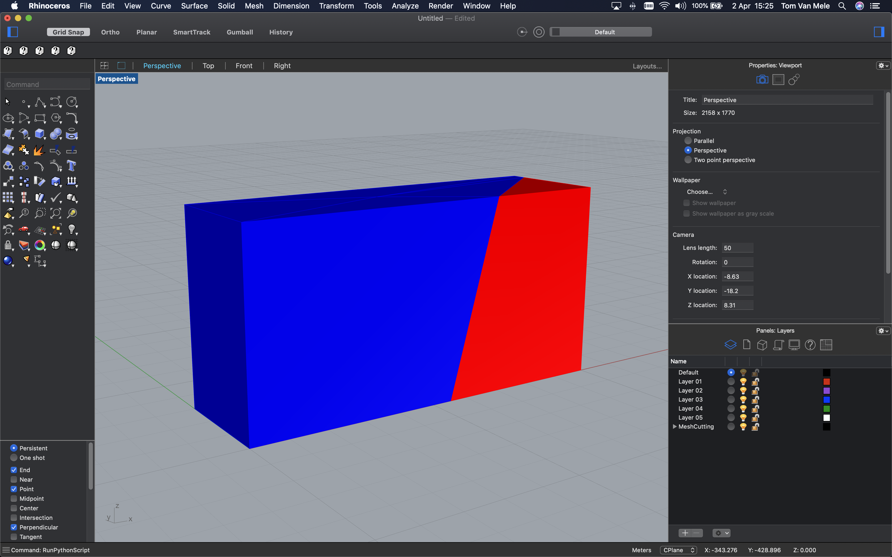

************
Mesh Cutting
************

In this example we will develop a simple script for spliting meshes using simple cutting planes,
and use the script in various environments.

We will only use functionality from the main COMPAS library, so no additional packages have to be installed.
If you prefer using the viewer instead of Rhino/Blender for visualisation, please follow the installation ibstructions
`here <https://github.com/compas-dev/compas_viewers>`_.

For the super impatient, Rhino and Belnder versions of the script are available for download here:

* :download:`mesh-cutting-rhino.py <mesh-cutting-rhino.py>`
* :download:`mesh-cutting-blender.py <mesh-cutting-blender.py>`

Imports
=======

We will build the mesh cutting algorithm from scratch using only functionality from the core COMPAS package (:mod:`compas`).
These are the required imports.

.. code-block:: python

    from math import radians

    from compas.geometry import Point
    from compas.geometry import Vector
    from compas.geometry import Plane
    from compas.geometry import Frame
    from compas.geometry import Box

    from compas.geometry import Translation
    from compas.geometry import Rotation

    from compas.geometry import intersection_segment_plane
    from compas.geometry import length_vector
    from compas.geometry import subtract_vectors
    from compas.geometry import dot_vectors

    from compas.datastructures import Mesh

Mesh Geometry
=============

As a starting point, we create a mesh from a simple box shape.

.. code-block:: python

    # note to self: this should be the default constructor

    box = Box.from_width_height_depth(10, 5, 3)
    mesh = Mesh.from_shape(box)

Cutting Plane
=============

For the cutting plane, we start with the YZ plane.

.. code-block:: python

    plane = Plane(Point(0, 0, 0), Vector(1, 0, 0))

We then rotate this plane around the Y axis and the Z axis and move it along the X axis.

.. code-block:: python

    Ry = Rotation.from_axis_and_angle(Vector(0, 1, 0), radians(10))
    Rz = Rotation.from_axis_and_angle(Vector(0, 0, 1), radians(-50))
    Tx = Translation([3, 0, 0])

    plane.transform(T * Rz * Ry)

Split Mesh
==========

Here we develop a very simple algortithm for splitting the mesh along the cutting plane.

1.  **Compute intersections**

    First we compute the intersections between the edges of the mesh and the cutting plane.
    And we split every mesh edge at the intersection point, if it exists.

    .. code-block:: python

        intersections = []

        for u, v in mesh.edges():
            a = mesh.vertex_attributes(u, 'xyz')
            b = mesh.vertex_attributes(v, 'xyz')
            x = intersection_segment_plane((a, b), plane)
            if not x:
                continue
            L_ax = length_vector(subtract_vectors(x, a))
            L_ab = length_vector(subtract_vectors(b, a))
            t = L_ax / L_ab
            key = mesh.split_edge(u, v, t=t, allow_boundary=True)
            intersections.append(key)

2.  **Split faces**

    We will not deal with the boundary cases here.
    Therefore, we only split the mesh if at least three intersection points exist.

    .. code-block:: python

        if len(intersections) > 2:
            for fkey in list(mesh.faces()):
                split = [key for key in mesh.face_vertices(fkey) if key in intersections]
                if len(split) == 2:
                    u, v = split
                    mesh.split_face(fkey, u, v)

3.  **Identify sides**

    To complete the split, we will have to identify the sub-meshes
    on either side of the cutting plane.
    We will identify one side as lying on the positive side of the cutting plane.
    And one side as the negative side.

    First we create two groups of vertices.

    .. code-block:: python

        o = plane.point
        n = plane.normal

        positive_vertices = []
        negative_vertices = []

        for key in mesh.vertices():
            if key in intersections:
                continue
            a = mesh.vertex_attributes(key, 'xyz')
            oa = subtract_vectors(a, o)
            similarity = dot_vectors(n, oa)
            if similarity > 0.0:
                positive_vertices.append(key)
            elif similarity < 0.0:
                negative_vertices.append(key)

    And then two groups of faces.

    .. code-block:: python

        positive_faces = []
        negative_faces = []

        for key in positive_vertices:
            positive_faces += mesh.vertex_faces(key)
        positive_faces = list(set(positive_faces))

        for key in negative_vertices:
            negative_faces += mesh.vertex_faces(key)
        negative_faces = list(set(negative_faces))

4.  **Create the positive mesh**

    .. code-block:: python

        vertices = {key: mesh.vertex_coordinates(key) for key in positive_vertices + intersections}
        faces = [mesh.face_vertices(fkey) for fkey in positive_faces]

        positive = Mesh.from_vertices_and_faces(vertices, faces)
        positive.add_face(positive.vertices_on_boundary(True))

4.  **Create the negative mesh**

    .. code-block:: python

        vertices = {key: mesh.vertex_coordinates(key) for key in negative_vertices + intersections}
        faces = [mesh.face_vertices(fkey) for fkey in negative_faces]

        negative = Mesh.from_vertices_and_faces(vertices, faces)
        negative.add_face(negative.vertices_on_boundary(True))

Rhino
=====

To visualize the result in Rhino, we only need a few additional lines of code.

.. code-block:: python

    from compas_rhino.artists import MeshArtist

    # ...

    artist = MeshArtist(positive, layer="MeshCutting::Positive")
    artist.clear_layer()
    artist.draw_faces(color=(255, 0, 0), join_faces=True)

    artist = MeshArtist(negative, layer="MeshCutting::Negative")
    artist.clear_layer()
    artist.draw_faces(color=(0, 0, 255), join_faces=True)

Blender
=======

.. figure:: mesh-cutting-blender.png
    :figclass: figure
    :class: figure-img img-fluid

To visualize the result in Blender, we only need a few additional lines of code.

.. code-block:: python

    from compas_blender.artists import MeshArtist

    # ...

    artist = MeshArtist(positive, layer="MeshCutting::Positive")
    artist.clear_layer()
    artist.draw_faces(color=(255, 0, 0), join_faces=True)

    artist = MeshArtist(negative, layer="MeshCutting::Negative")
    artist.clear_layer()
    artist.draw_faces(color=(0, 0, 255), join_faces=True)

