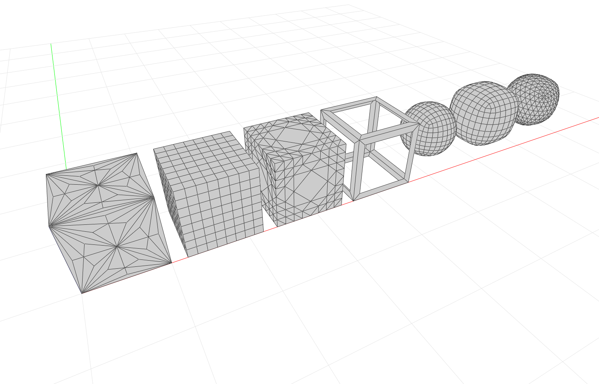

**********************
Subdivision Algorithms
**********************

Side-by-side comparison of various mesh subdivision algorithms in COMPAS.

* Environment: Viewer
* COMPAS version: 0.13.0
* Other requirements: :mod:`compas_viewers`

.. literalinclude:: mesh-subd.py
    :language: python
